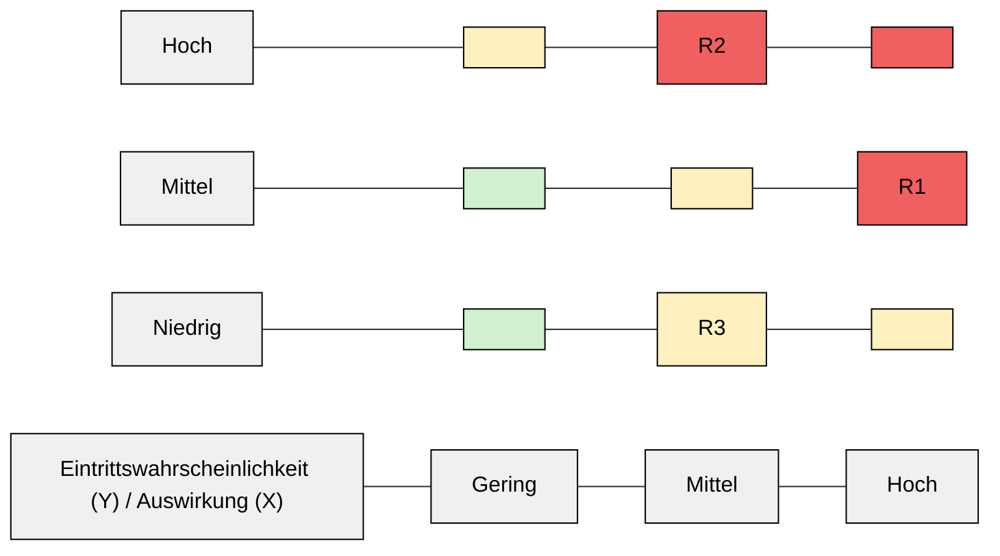

# 4.1 Bestellprozess Webshop

### 4.1.1 Kurzbeschreibung des Prozesses

Der Bestellprozess beschreibt alle Schritte von der Nutzung des Webshops durch Kundinnen und Kunden bis zur erfolgreichen Anlage und Bearbeitung einer Bestellung im internen System. Dazu gehören Warenkorbfunktionen, Zahlungsabwicklung über einen externen Zahlungsdienstleister sowie die Bestellbestätigung per E‑Mail.

### 4.1.2 Ablauf (vereinfacht)

1. Kunde ruft Webshop auf und legt Produkte in den Warenkorb.
2. Kunde meldet sich an oder gibt Adress‑ und Kontaktdaten ein.
3. Auswahl der Zahlungsart und Weiterleitung zum Zahlungsdienstleister.
4. Zahlungsbestätigung → Bestellung wird im System angelegt.
5. Kunde erhält Bestellbestätigung per E‑Mail.

### 4.1.3 Risiken & Bewertung

<table data-table-width="760" data-layout="default" data-local-id="75823dff-14e1-40fc-8c90-66b239f3b3df" class="confluenceTable"><colgroup><col style="width: 94.0px;"><col style="width: 334.0px;"><col style="width: 173.0px;"><col style="width: 152.0px;"></colgroup><tbody><tr data-local-id="3ada5178fbb7"><th data-local-id="2c02beb112db" class="confluenceTh">
<strong>Risiko-ID</strong>
</th><th data-local-id="d62f6b9bd091" class="confluenceTh">
<strong>Beschreibung</strong>
</th><th data-local-id="23a4fddfdb5b" class="confluenceTh">
<strong>Wahrscheinlichkeit</strong>

<strong>des Eintritts (1-5)</strong>
</th><th data-local-id="7ea87ee7418f" class="confluenceTh">
<strong>Grad der</strong>

<strong>Auswirkung (1-5)</strong>
</th></tr><tr data-local-id="0c7ce4e58a74"><td data-local-id="100996f2c838" class="confluenceTd">
R1
</td><td data-local-id="812c97bf4999" class="confluenceTd">
Ausfall des Webshops während Hauptverkaufszeiten

&nbsp;Ursache/Auswirkung/best. Maßnahmen

<ul local-id="c4e5b203-e813-48a3-8cf0-980285a1b921"><li local-id="ab56303c-0efc-44fa-930e-29304039dc11">
Ursache: Technischer Fehler beim Hoster, fehlerhaftes Update, Überlastung
</li><li local-id="03080361-0491-4e15-8aeb-2c82e82a5616">
Auswirkung: Umsatzverlust, Image‑Schaden, Supportanfragen steigen
</li><li local-id="5b00f4a5-bef4-4a91-b496-019bae95fd49">
Bestehende Maßnahmen: Hosting mit SLA, Monitoring, Staging‑System
</li></ul>

</td><td data-local-id="8d33f624c2a4" class="confluenceTd">
3
</td><td data-local-id="3598c5ce8548" class="confluenceTd">
5
</td></tr><tr data-local-id="0caef2dde34d"><td data-local-id="fd795d2851e5" class="confluenceTd">
R2
</td><td data-local-id="4ef5c5f5dc52" class="confluenceTd">
Kompromittierung von Kundenkonten durch schwache Passwörter

&nbsp;Ursache/Auswirkung/best. Maßnahmen

Ursache: Benutzer wählen einfache oder wiederverwendete Passwörter; kein verpflichtender Einsatz von MFA; unzureichende Passwort‑Richtlinien im Webshop. 

Auswirkung: Unautorisierte Bestellungen, Einsicht in personenbezogene Daten, potenzielle DSGVO‑Incidents und Vertrauensverlust bei Kundinnen und Kunden. 

Bestehende Maßnahmen: Mindestanforderungen an Passwortlänge, Rate‑Limiting bei Login‑Versuchen, Sperrung nach mehreren Fehlversuchen, grundlegende Passwort‑Hinweise im Frontend

</td><td data-local-id="5e442983cc3a" class="confluenceTd">
3
</td><td data-local-id="ff7cd5044744" class="confluenceTd">
4
</td></tr><tr data-local-id="a165a88fb8b3"><td data-local-id="8f4fd5c76358" class="confluenceTd">
R3
</td><td data-local-id="6f16e9c0d692" class="confluenceTd">
Manipulation von Bestelldaten auf dem Transportweg

&nbsp;Ursache/Auswirkung/best. Maßnahmen

Ursache: Fehlende oder falsch konfigurierte TLS‑Verschlüsselung, veraltete Protokolle/Zertifikate, unsichere Weiterleitungen. 

Auswirkung: Verfälschte Bestell‑ oder Kundendaten, möglichen Datenabfluss, rechtliche Risiken durch Verlust der Datenintegrität. 

Bestehende Maßnahmen: Einsatz aktueller TLS‑Zertifikate, erzwungene HTTPS‑Weiterleitung, regelmäßige Zertifikats‑Erneuerung und technische Überprüfung der SSL/TLS‑Konfiguration.

</td><td data-local-id="0a9748f8101c" class="confluenceTd">
2
</td><td data-local-id="37f3b44e0815" class="confluenceTd">
5
</td></tr><tr data-local-id="11114a18adbc"><td data-local-id="ca69190fa530" class="confluenceTd">
R4

</td><td data-local-id="a4c2d9fe2acb" class="confluenceTd">
Fehlbuchungen durch Fehler im Zahlungs‑Redirect

&nbsp;Ursache/Auswirkung/best. Maßnahmen

Ursache: Fehlkonfiguration oder Instabilität der Schnittstelle zum Zahlungsdienstleister, Timeouts oder fehlende Rückbestätigungen bei Transaktionen.

 Auswirkung: Bestellungen ohne verbuchte Zahlung, doppelte Belastungen, Abstimmungsprobleme in der Buchhaltung und erhöhte Reklamations‑/Supportaufwände. 

Bestehende Maßnahmen: Technische Tests der Zahlungsstrecke vor Releases, Logging von Transaktionen und Rückmeldungen, definierte Klärungsprozesse mit dem Zahlungsdienstleister.

</td><td data-local-id="c0483fa229d2" class="confluenceTd">
2
</td><td data-local-id="c0d76c576851" class="confluenceTd">
4
</td></tr></tbody></table>

### 4.1.4 Visualisierte Risk-Matrix

**Ergebnis der Risikoanalyse Bestellprozess:**  
Die höchsten Risiken sind R1 (Webshop‑Ausfall) und R2 (Kontenkompromittierung) mit Risikowerten 15 und 12. Diese werden im Maßnahmenplan vorrangig behandelt. Die Matrix zeigt, dass Verfügbarkeit und Kundensicherheit die kritischsten Bereiche sind.