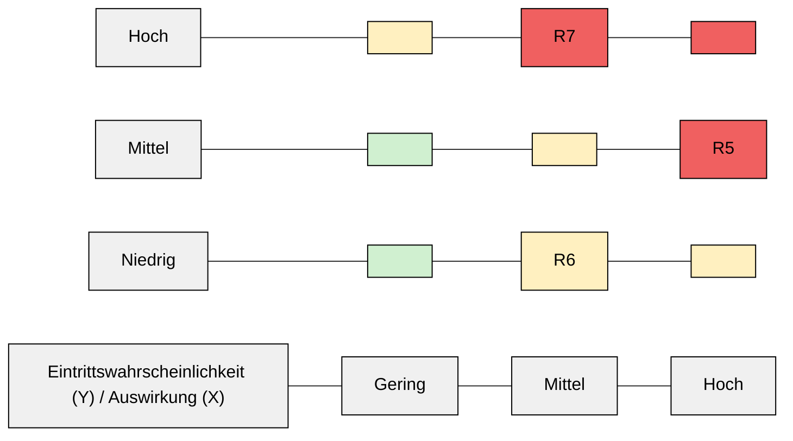

# 4.2 Kundendaten / CRM

### 4.2.1 Kurzbeschreibung des Prozesses

Das CRM‑System dient der Verwaltung von Kundendaten, Bestellhistorien, Kontakten und Support‑Tickets. Es umfasst die Erfassung personenbezogener Daten (Name, Adresse, E‑Mail, Telefon) sowie die Zuordnung zu Bestellungen und Support‑Fällen.

### 4.2.2 Ablauf (vereinfacht)

1. Kunde erstellt Account oder gibt Daten bei Bestellung ein.
2. Daten werden im CRM gespeichert und mit Bestellung verknüpft.
3. Mitarbeitende greifen auf Kundendaten für Support, Marketing, Buchhaltung zu.
4. Regelmäßige Backups und Löschung nach DSGVO.

### 4.2.3 Risiken & Bewertung

<table data-table-width="760" data-layout="default" data-local-id="cccb53155481" class="confluenceTable"><colgroup><col style="width: 71.0px;"><col style="width: 322.0px;"><col style="width: 160.0px;"><col style="width: 196.0px;"></colgroup><tbody><tr data-local-id="4c7a95e3ee01"><th data-local-id="a18046a762c5" class="confluenceTh">
Risiko-ID
</th><th data-local-id="3195abeb8107" class="confluenceTh">
Beschreibung
</th><th data-local-id="4992bea4bc93" class="confluenceTh">
Wahrscheinlichkeit (1–5)
</th><th data-local-id="bdec4344e43a" class="confluenceTh">
Auswirkungsschwere (1–5)
</th></tr><tr data-local-id="2d32eb705d6e"><td data-local-id="5a5e3e733599" class="confluenceTd">
R5
</td><td data-local-id="1b6d21bccbcb" class="confluenceTd">
Kundendaten‑Leak durch unbefugten Zugriff

&nbsp;Ursache/Auswirkung/best. Maßnahmen

<ul local-id="60129c4f-1a02-45f3-8206-33cf295f0992"><li local-id="b6256c35-2082-48d8-8102-0a7c55c54362">
<strong>Ursache:</strong> Schwache Passwörter der Mitarbeitenden, fehlende MFA, interne Missbrauch.
</li><li local-id="47458917-fc48-4382-bd84-0b3bce66fb4d">
<strong>Auswirkung:</strong> DSGVO‑Verstoß, Geldstrafen, massiver Reputationsschaden.
</li><li local-id="697f14ac-da4d-4c67-bde6-d7cd8f00b66a">
<strong>Bestehende Maßnahmen:</strong> Passwortrichtlinien, 2FA für Admin‑Zugriffe, Logging.
</li></ul>

</td><td data-local-id="e1d1bf780f3a" class="confluenceTd">
3
</td><td data-local-id="6f300efa0b27" class="confluenceTd">
5
</td></tr><tr data-local-id="72bcb060725e"><td data-local-id="c9eb61b28f6e" class="confluenceTd">
R6
</td><td data-local-id="60cbc4e1a48f" class="confluenceTd">
Verlust von Kundendaten durch Systemausfall

&nbsp;Ursache/Auswirkung/best. Maßnahmen

<ul local-id="e95ff84c-0c19-4909-bb20-d123bcde2960"><li local-id="7453f213-c258-49c7-9234-c8060c1f799b">
<strong>Ursache:</strong> Cloud‑Provider‑Ausfall, fehlende Backups, Ransomware.
</li><li local-id="f1e370b5-1f70-43c2-91be-1064ad7b664c">
<strong>Auswirkung:</strong> Datenverlust, Neuanlage von Kundenkontakten, rechtliche Konsequenzen.
</li><li local-id="d0038ad9-13c4-4bfc-9a18-9d90d823192b">
<strong>Bestehende Maßnahmen:</strong> Tägliche Backups, 3‑2‑1‑Backup‑Regel, Testrestores.
</li></ul>

</td><td data-local-id="90423b06eadf" class="confluenceTd">
2
</td><td data-local-id="6c22d8955f31" class="confluenceTd">
5
</td></tr><tr data-local-id="f70264c987a9"><td data-local-id="cf2a872321c5" class="confluenceTd">
R7
</td><td data-local-id="399dd55efb7b" class="confluenceTd">
Fehlende Löschung personenbezogener Daten

&nbsp;Ursache/Auswirkung/best. Maßnahmen

<ul local-id="563c3a37-ccfe-4ba5-b138-2be3cfb6f566"><li local-id="0a8d280e-9263-4d01-9d3b-06793021aa61">
<strong>Ursache:</strong> Unklare Prozesse bei Kündigung, fehlende Erinnerungen.
</li><li local-id="aff4cee6-d0a9-4646-abd7-b339540734d9">
<strong>Auswirkung:</strong> DSGVO‑Verstoß, Strafen, Vertrauensverlust.
</li><li local-id="8c02c6db-2462-42e9-b03d-d2f44b6d80f6">
<strong>Bestehende Maßnahmen:</strong> Automatische Löschung nach 36 Monaten Inaktivität, Prozess für Löschung auf Wunsch.
</li></ul>

</td><td data-local-id="8e44dec86c3d" class="confluenceTd">
4
</td><td data-local-id="3f7d5a450810" class="confluenceTd">
4
</td></tr></tbody></table>

### 4.2.4 Visualisierte Risikomatrix

