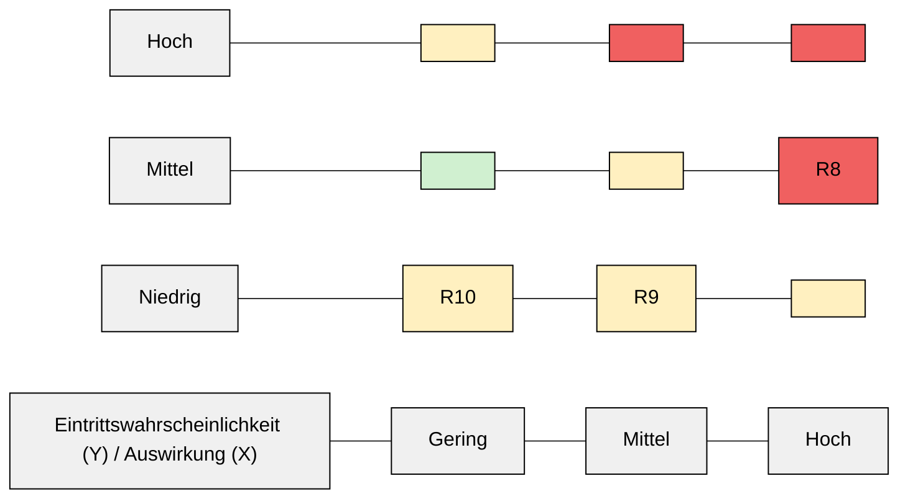

# 4.3 Website / Webshop

### 4.3.1 Kurzbeschreibung des Prozesses

Die Website / Webshop umfasst den öffentlich zugänglichen Webshop sowie die zugehörige Hosting‑Infrastruktur (Webserver, Datenbank, DNS). Sie dient der Präsentation des Sortiments, der Bestellabwicklung und der Kundeninteraktion.

### 4.3.2 Ablauf (vereinfacht)

1. Nutzer rufen Website / Webshop auf (DNS → Hosting → Webserver).
2. Lade Produktkatalog, Bilder, Preise.
3. Interaktion: Warenkorb, Login, Checkout.
4. Dynamische Inhalte aus Datenbank (Produkte, Bestellstatus).

### 4.3.3 Risiken & Bewertung

<table data-table-width="760" data-layout="default" data-local-id="a85b141b5d45" class="confluenceTable"><colgroup><col style="width: 68.0px;"><col style="width: 347.0px;"><col style="width: 160.0px;"><col style="width: 181.0px;"></colgroup><tbody><tr data-local-id="bf1d6077525f"><th data-local-id="5c42995bb54b" class="confluenceTh">
Risiko-ID
</th><th data-local-id="c45208bc4ea3" class="confluenceTh">
Beschreibung
</th><th data-local-id="42a2173b64ed" class="confluenceTh">
Wahrscheinlichkeit (1–5)
</th><th data-local-id="826c6a42b06d" class="confluenceTh">
Auswirkungsschwere (1–5)
</th></tr><tr data-local-id="45bf928c0527"><td data-local-id="ec71de7922a3" class="confluenceTd">
R8
</td><td data-local-id="44aa527da5bb" class="confluenceTd">
DDoS‑Attacke auf Webshop

&nbsp;Ursache/Auswirkung/best. Maßnahmen

<ul local-id="81416b8b-505a-4573-b9ef-31f2610e88e3"><li local-id="27dedc67-fdd0-4672-845d-310c132ddebc">
<strong>Ursache:</strong> Angriffe von Bots oder Konkurrenz, fehlende DDoS‑Schutzmaßnahmen.
</li><li local-id="8621c352-75d1-47f5-b635-936173213e48">
<strong>Auswirkung:</strong> Webshop nicht erreichbar, Umsatzverlust, Panik bei Kunden.
</li><li local-id="c7366bfe-705c-4616-9e1e-a979dae37a9c">
<strong>Bestehende Maßnahmen:</strong> Cloudflare oder Hoster mit DDoS‑Mitigation, Rate‑Limiting.
</li></ul>

</td><td data-local-id="f8eaf3a54a38" class="confluenceTd">
3
</td><td data-local-id="b481873056a8" class="confluenceTd">
5
</td></tr><tr data-local-id="b31d5ac91e1f"><td data-local-id="e3482a46f007" class="confluenceTd">
R9
</td><td data-local-id="a7ac3636f3f5" class="confluenceTd">
Website‑Defacement (Vandalismus)

&nbsp;Ursache/Auswirkung/best. Maßnahmen

<ul local-id="396357a2-99cb-4e4a-919d-457ff9f9b04f"><li local-id="038ab57c-46b6-47bf-b0e5-4822989a7072">
<strong>Ursache:</strong> Schwachstellen im CMS, unsichere Admin‑Accounts, fehlende Patches.
</li><li local-id="e0d3de88-4d2d-4840-93cf-23176f60dfff">
<strong>Auswirkung:</strong> Vertrauensverlust, Image‑Schaden, rechtliche Risiken.
</li><li local-id="db39d625-908b-4338-953e-0c5eda11a83e">
<strong>Bestehende Maßnahmen:</strong> Regelmäßige Updates, WAF (Web Application Firewall), File‑Integrity‑Monitoring.
</li></ul>

</td><td data-local-id="de84266fcfa5" class="confluenceTd">
2
</td><td data-local-id="335b3fe8569a" class="confluenceTd">
5
</td></tr><tr data-local-id="416683367fba"><td data-local-id="e1ef28488229" class="confluenceTd">
R10
</td><td data-local-id="0d0ed8d84bd8" class="confluenceTd">
SSL/TLS‑Zertifikat abgelaufen

&nbsp;Ursache/Auswirkung/best. Maßnahmen

<ul local-id="4f816aaf-516a-4c13-ab55-fb692d4ebc94"><li local-id="44b4b198-4251-49a3-bb30-de3a1bba6ee6">
<strong>Ursache:</strong> Vergessen der automatischen Erneuerung, manuelle Fehler.
</li><li local-id="aea030e9-9f3d-4179-8c63-088a078d1820">
<strong>Auswirkung:</strong> Browser warnen vor unsicherer Verbindung, Kundenabwanderung.
</li><li local-id="5e4bd522-7703-4ff8-9aac-1081dd4e9b1f">
<strong>Bestehende Maßnahmen:</strong> Automatische Zertifikats‑Erneuerung (Let's Encrypt), Monitoring.
</li></ul>

</td><td data-local-id="6661586d526e" class="confluenceTd">
1
</td><td data-local-id="eeccb0d2544b" class="confluenceTd">
4
</td></tr></tbody></table>

### 4.3.4 Visualisierte Risikomatrix

